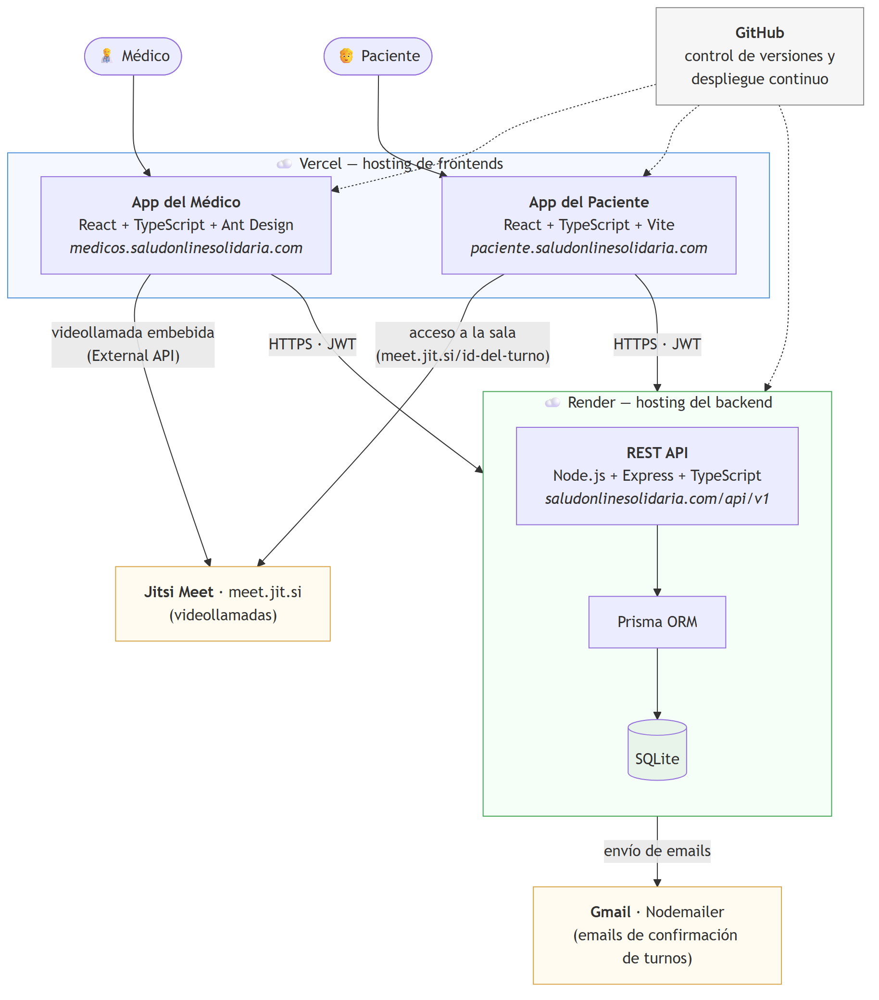

# Medicina Clínica 4.0. La gestión de la medicina clínica en un marco post pandémico y con perfil solidario.

# Introducción

El mercado de la salud ha estado históricamente ligado a encuentros médico-paciente físicos, exámenes manuales y protocolos de tratamiento que dependen completamente de la participación humana. La industria ha evolucionado rápidamente ante la necesidad de adoptar enfoques más efectivos impulsados por las nuevas tecnologías, y el COVID-19 impulsó esta evolución, ya que las instituciones de atención médica tuvieron que limitar el contacto en persona con sus pacientes. Ahora llega la Medicina 4.0, un concepto impulsado por la tecnología que transforma la industria de la salud tradicional tal como la conocemos.

La Medicina 4.0 es un concepto recién acuñado que se desarrolla a partir del término Industria 4.0. El concepto de Industria 4.0 refiere a una nueva manera de producir mediante la adopción de tecnologías 4.0, es decir, de soluciones enfocadas en la interconectividad, la automatización y los datos en tiempo real. El término Medicina 4.0 se refiere a una amplia gama de posibilidades para utilizar las tecnologías de la Industria 4.0 para mejorar la atención médica, ya que presenta una visión nueva e innovadora para el sector de la salud. El objetivo es brindar a los pacientes mejores servicios de atención médica, con más valor agregado y más rentables, al mismo tiempo que se mejora la eficacia y la eficiencia de la industria.

El acceso a la atención médica es un derecho humano vital, pero la pandemia de COVID-19 ha ejercido presión sobre los sistemas de atención médica en todo el mundo. Los profesionales han estado limitando el contacto en persona con sus pacientes debido a las preocupaciones sobre la transmisión del nuevo coronavirus y, como resultado, los pacientes que no son urgentes a menudo se ven privados de la capacidad de obtener asistencia médica.

Debido a la saturación de los sistemas de salud que ocasionó la pandemia de COVID-19 nace una organización llamada Salud Online Solidaria (SOS). El fin de esta organización es ayudar a todos esos pacientes que han sido dejados de lado por el sistema de salud, en especial a los sectores más vulnerables. Brindan un espacio de consultoría virtual, sin costo alguno, para cualquiera que lo necesite, sin importar su ubicación. A pesar de que la pandemia ya es cosa del pasado, las consultas no paran de aumentar, por lo que aparece la necesidad de automatizar tareas y mejorar la infraestructura.

***[Esta sección concluye con un párrafo en donde se adelanta el resto del informe. Este párrafo dejemoslo para lo último, una vez que esté listo todo el informe].***

# Antecedentes

### Sistemas o proyectos similares que tuvieron éxito o fracasaron.

En primera instancia tenemos el caso de Teladoc Health. Es una empresa estadounidense que se dedica a la telemedicina. Tuve la oportunidad de desempeñarme como Ingeniero en Software en ella por 2 años. Trabaje en distintos equipos donde día a día trabajamos en crear nuevas maneras de poder servir a los pacientes utilizando las nuevas tecnologías. Esta empresa logró posicionar múltiples productos en el mercado, pero sin dudas el más exitoso es Solo™.

**Solo™ Virtual Care Platform**

<https://business.teladochealth.com/platform/>

Solo™ es una plataforma de software completa e integrada creada en una red basada en la nube que ofrece una experiencia de atención virtual escalable para diversos casos de uso, entornos de atención y presupuestos. Conecta personas, sistemas de atención médica, sistemas HIT, dispositivos y aplicaciones de software de terceros en una sola plataforma, lo que permite a los proveedores ofrecer atención de primer nivel en cualquier momento y en cualquier lugar. Solo™ proporciona admisión digital de pacientes con recorridos configurables, arquitectura centrada en el paciente y coordinación de la atención integral con flujos de trabajo de usuario personalizables. Con inicio de sesión único, funciones y controles de acceso de usuarios, garantiza la seguridad y la facilidad de uso. La plataforma admite prácticas pequeñas para sistemas de salud empresariales, promueve la interoperabilidad de EHR y ofrece una vista administrativa para una gestión simplificada de programas y usuarios. La interfaz de usuario actualizada permite visitas virtuales y conferencias grupales sin interrupciones, y el panel de control del usuario permite a los usuarios administrar todas las interacciones de atención virtual de manera efectiva. Además, Solo™ proporciona un portal de análisis y un servicio de intercambio de datos, lo que facilita la toma de decisiones informada. Sus módulos configurables se adaptan a las preferencias individuales de los usuarios y los flujos de trabajo clínicos, llenando los vacíos del flujo de trabajo para crear una solución de atención virtual personalizada que satisfaga necesidades únicas. En última instancia, Solo™ pone a los clientes en control de su experiencia de atención virtual, agilizando los procesos de atención, mejorando la participación del paciente y mejorando la prestación de atención médica en general. En cuanto a sus costos, Solo™ es una solución empresarial cuyos precios no son públicos y se negocian directamente con cada institución de salud según el volumen de usuarios y las funcionalidades requeridas, lo que la hace inaccesible para organizaciones sin fines de lucro o con presupuesto limitado. Desde una perspectiva personal, Solo™ representa el estado del arte en plataformas de telemedicina empresarial. Su completitud funcional y su capacidad de integración son notables, y sirvió como referencia de diseño al momento de pensar las funcionalidades del sistema de SOS. Sin embargo, su viabilidad para un fin solidario es nula: está diseñada para grandes instituciones con recursos significativos, y su modelo de negocio es incompatible con la gratuidad y el acceso abierto que requiere una organización como SOS.

A su vez, si nos vamos al ámbito local, Medifé lanzó hace ya 2 años su propia app de telemedicina.

**Cam Doctor**

<https://camdoctor.medife.com.ar/>

Cam Doctor es un servicio de telemedicina exclusivo para asociados/as de Medifé, disponible para todos los planes. Mediante esta plataforma, los usuarios pueden acceder a consultas médicas en video a través de internet, las 24 horas del día, todos los días de la semana. Las especialidades ofrecidas incluyen pediatría, clínica médica y odontología. Para utilizar Cam Doctor, los asociados pueden acceder a través de la página web de Medifé o mediante la aplicación gratuita Medifé Móvil en dispositivos Android e iOS. Durante la consulta, los pacientes pueden compartir documentos con el profesional médico y recibir notificaciones por correo electrónico para la confirmación, recordatorio y cancelación de turnos. Medife aclara con fervor que Cam Doctor no debe utilizarse en casos de emergencia o riesgo de vida, ya que se trata de una consulta orientativa y no reemplaza la atención de un médico de cabecera o un servicio de urgencias. La plataforma también permite a los médicos recetar medicamentos en ciertos casos mediante recetas digitales que pueden presentarse en farmacias adheridas a la red de Medifé. En general, Cam Doctor busca ofrecer a los usuarios una experiencia de telemedicina conveniente y accesible, respaldada por la tecnología de Google. En términos de costo, Cam Doctor no tiene cargo adicional para los asociados de Medifé: su acceso es una extensión del plan de medicina prepaga contratado. Al igual que E-Consulta, queda fuera del alcance de quienes no cuenten con esta cobertura privada. En términos personales, Cam Doctor es una plataforma funcional y bien ejecutada dentro de su contexto. Sus limitaciones de especialidades y su restricción a afiliados la hacen poco útil como modelo a seguir para SOS. Su viabilidad solidaria es baja: al estar atada a una prepaga privada, excluye por definición a los sectores más vulnerables que SOS busca atender.

**E-Consulta**

<https://www.swissmedical.com.ar/prepagaclientes/novedades/articulos/2018/08/08/e-consulta-tu-medico-en-linea/>

E-Consulta es el servicio de telemedicina de Swiss Medical Group, disponible exclusivamente para sus afiliados. Permite acceder a consultas médicas por videollamada a través de la Swiss Medical App o mediante la web institucional, las 24 horas del día, los 7 días de la semana. Para utilizarlo, el usuario debe ingresar a la aplicación, seleccionar la opción E-Consulta, indicar el integrante del grupo familiar que requiere atención y elegir la especialidad y el motivo de consulta. El servicio está incluido en todos los planes de Swiss Medical sin costo adicional, aunque al tratarse de un servicio de medicina prepaga, su acceso está condicionado al pago de la cuota mensual del plan contratado. Swiss Medical cuenta con una red de más de 81.500 profesionales de todas las especialidades. Al igual que otras plataformas de telemedicina, E-Consulta no debe utilizarse ante emergencias o riesgos de vida. A nivel personal, E-Consulta es una propuesta sólida dentro del ecosistema de Swiss Medical, con la ventaja de estar disponible las 24 horas y contar con una red médica extensa. Sin embargo, al igual que Cam Doctor, su viabilidad para un fin solidario es nula: el acceso está condicionado al pago de una cuota de medicina prepaga, lo que la convierte en una herramienta exclusiva del sector privado y la aleja completamente del perfil de usuario que atiende SOS.

**DOC24**

<https://www.doc24.com.ar/>

DOC24 es una empresa latinoamericana de salud digital con presencia en Argentina, Brasil y México. A diferencia de otras plataformas orientadas directamente al paciente individual, DOC24 opera principalmente en un modelo B2B, ofreciendo soluciones de telemedicina para hospitales, clínicas y empresas. Sus productos incluyen videoconsultas médicas, una plataforma de bienestar corporativo denominada Wehealthy, estaciones de diagnóstico físico y el servicio Maletín Diagnóstica para atención domiciliaria. La plataforma es accesible mediante aplicaciones móviles para iOS y Android, así como a través de la web, y se integra fácilmente con sistemas existentes mediante API y SDK. Sus soluciones son configurables y de marca blanca (white-label), lo que permite a las instituciones personalizarlas. Al estar orientada a empresas e instituciones de salud, DOC24 no ofrece acceso directo a usuarios individuales sin afiliación a una entidad cliente de su servicio, lo que la aleja del alcance de los sectores más vulnerables. En lo personal, DOC24 resulta interesante como referente tecnológico por su enfoque modular, su integración mediante API y sus soluciones white-label. Sin embargo, su orientación B2B la hace completamente inviable como modelo para SOS: no está pensada para el paciente individual que busca atención gratuita, sino para instituciones con capacidad de contratar y financiar el servicio. Su mayor utilidad para este trabajo fue ilustrar el grado de sofisticación al que puede llegar una plataforma de salud digital.

**Teleconsultas BA**

<https://buenosaires.gob.ar/teleconsultas>

Teleconsultas BA es el servicio de atención médica a distancia del Gobierno de la Ciudad Autónoma de Buenos Aires. Es completamente gratuito para residentes de la Ciudad y permite acceder a profesionales de los centros de salud y hospitales de la red pública porteña, ya sea por teléfono o por videollamada. Para la modalidad de videollamada, el paciente debe contar con acceso a internet y un dispositivo con cámara —computadora o celular—. Los turnos se solicitan llamando al 147 de lunes a viernes de 7 a 21 h. y los sábados de 8 a 14 h., indicando expresamente que se desea una teleconsulta; desde fuera de la Ciudad puede llamarse al 0800-999-2727. El operador solicita el número de documento de identidad y un teléfono de contacto, y asigna un profesional del centro de salud más cercano al domicilio del paciente. Si bien su carácter público y gratuito la convierte en un antecedente relevante, su alcance está limitado geográficamente a la Ciudad de Buenos Aires y su disponibilidad está condicionada a los recursos del sistema de salud público. Personalmente, Teleconsultas BA es el antecedente más cercano en espíritu a lo que propone SOS: un servicio gratuito, público y orientado a quien no puede costear una consulta privada. Su principal limitación es geográfica —circunscrita a la Ciudad de Buenos Aires— y su dependencia del sistema público la hace variable en disponibilidad. Para SOS, que opera desde Bahía Blanca y apunta a todo el país, este modelo es inspirador pero insuficiente. Demuestra que es posible ofrecer telemedicina gratuita, aunque con alcance acotado.

**UMA - Suscripciones médicas digitales**

<https://umasalud.com/suscripciones>

ÜMA Salud es una plataforma argentina de salud y bienestar digital basada en inteligencia artificial, orientada a facilitar el acceso a servicios médicos de forma ágil y segura. Ofrece dos modalidades principales: la Guardia Online, que funciona por orden de llegada sin turno previo, ideal para consultas urgentes; y los Especialistas Online, que permiten agendar consultas programadas con profesionales de más de 20 especialidades, entre ellas clínica médica, pediatría, ginecología, dermatología, cardiología, nutrición y psicología, entre otras. Los profesionales pueden emitir recetas digitales válidas en farmacias adheridas, y la plataforma centraliza el historial médico del usuario. Está disponible mediante aplicaciones móviles para iOS y Android, y también a través de la web. Funciona bajo un modelo de suscripción mensual pago: el plan Guardia Premium tiene un costo de $10.400 por mes e incluye 5 consultas mensuales, mientras que el plan ÜMA Bienestar cuesta $14.700 por mes con 4 consultas incluidas, aceptando pagos con tarjeta de débito, crédito y Mercado Pago. Si bien ÜMA representa una solución moderna y accesible dentro del sector privado, su modelo de pago la hace inviable como alternativa para los sectores de mayor vulnerabilidad económica que atiende Salud Online Solidaria. Desde mi punto de vista, ÜMA Salud es la plataforma comercial orientada al individuo más completa del mercado local. Su interfaz, su modelo de suscripción flexible y la variedad de especialidades la posicionan como una referencia valiosa en términos de experiencia de usuario. No obstante, su viabilidad para un fin solidario como SOS es nula en su forma actual: el pago mensual es una barrera infranqueable para los sectores más vulnerables. Resulta útil como referencia de diseño e inspiración, pero sus premisas comerciales son opuestas a las de una organización sin fines de lucro.

En el contexto actual, la medicina 4.0 parece estar experimentando un auge notable, respaldado por el éxito de empresas como Teladoc Health, Medifé y muchas otras. Si bien existen numerosos ejemplos de sistemas y proyectos similares que han tenido éxito, no conozco casos de productos similares en el ámbito de la telemedicina que hayan fracasado hasta la fecha.

Es relevante destacar que todos estos productos mencionados son impulsados por empresas con fines de lucro, lo que indica el interés del sector privado en capitalizar las oportunidades que ofrece la telemedicina. Este enfoque comercial puede resultar en una mayor inversión en investigación, desarrollo y mejora continua de las plataformas, lo que a su vez contribuye al éxito y aceptación de estos servicios.

Además, es interesante notar que no se han encontrado productos de telemedicina de esta índole ofrecidos de manera gratuita por gobiernos, ONGs u otras organizaciones sin fines de lucro. Esto puede deberse a diversos factores, como los altos costos asociados con el desarrollo y mantenimiento de plataformas de telemedicina, la necesidad de recursos tecnológicos avanzados y la demanda de un equipo de profesionales de la salud altamente capacitado para brindar servicios de calidad.

### Salud online solidaria hoy

Salud Online Solidaria implementa un proceso algo rudimentario para atender a sus pacientes de manera virtual. El procedimiento comienza cuando el paciente busca atención médica comunicándose a través de plataformas como WhatsApp o Instagram, donde detalla el motivo de su consulta. Un miembro administrador/a de la organización recibe el mensaje y se encarga de facilitar la coordinación del encuentro.

Este administrador/a posee un registro actualizado con los horarios disponibles de cada médico voluntario que colabora con la organización. Con esta información en mano, la administradora trabaja en conjunto con el paciente para acordar un horario que sea conveniente para ambos.

Una vez que se ha establecido el horario de la consulta virtual, el paciente proporciona su dirección de correo electrónico para que la administradora pueda programar una reunión por medio de Zoom o una plataforma similar. Este enfoque garantiza una interacción segura y cómoda para ambas partes.

Llegado el día de la consulta, tanto el médico como el paciente se conectan a través de Zoom para llevar a cabo la reunión. La videoconferencia permite una comunicación efectiva y personalizada, brindando al paciente la oportunidad de discutir sus inquietudes de manera directa con el profesional de la salud.

El enfoque de Salud Online Solidaria presenta varias ventajas significativas en su proceso para brindar atención médica virtual. En primer lugar, la accesibilidad y comodidad para los pacientes se ven mejoradas al utilizar aplicaciones de mensajería y plataformas de videoconferencia, lo que elimina la necesidad de desplazarse físicamente a una consulta y beneficia a aquellos con dificultades de movilidad o que viven en áreas remotas.

Además, la intervención del administrador/a agiliza la coordinación de los horarios de los médicos voluntarios, lo que garantiza una programación eficiente y oportuna de las consultas. Esta flexibilidad horaria resultante permite que tanto los pacientes como los médicos encuentren horarios que se ajusten a sus disponibilidades, lo que se traduce en una mayor satisfacción y dedicación en cada caso.

Asimismo, la utilización de plataformas seguras como Zoom garantiza la privacidad y confidencialidad de las interacciones médicas virtuales, lo que brinda confianza tanto a pacientes como a profesionales de la salud. En Argentina, la Ley de Protección de Datos Personales N° 25.326 y sus modificatorias establecen un marco legal estricto para el tratamiento de los datos personales, incluyendo los datos de salud. Esta ley asegura que cualquier tratamiento de datos personales debe ser legítimo, basado en el consentimiento del titular de los datos, y que la información recopilada sea pertinente, no excesiva y adecuada para el propósito para el cual se obtiene.

Además, la ley enfatiza la importancia de implementar medidas de seguridad adecuadas para proteger los datos personales contra accesos no autorizados, pérdidas o divulgaciones indebidas. Esto significa que plataformas como Zoom deben demostrar cómo cumplen con estas obligaciones legales en Argentina, garantizando que la privacidad y confidencialidad de las interacciones médicas virtuales se mantengan en todo momento. El cumplimiento de estas normativas no solo es crucial para evitar sanciones legales, sino también para mantener la confianza entre los pacientes y los profesionales de la salud. Al garantizar un alto nivel de seguridad y confidencialidad, se fomenta un entorno en el cual los pacientes se sienten más cómodos compartiendo información vital para su diagnóstico y tratamiento, contribuyendo así a la efectividad de la telemedicina.

Por otro lado, el proceso actual también presenta algunas desventajas que deben ser consideradas. La dependencia del administrador/a para coordinar los horarios puede generar demoras en situaciones de alta demanda o si no hay suficiente personal administrativo disponible. Además, esto puede resultar en una disponibilidad limitada de horarios, ya que las citas se programan según el horario de trabajo del personal administrativo.

La comunicación a través de aplicaciones de mensajería y redes sociales puede aumentar el riesgo de malentendidos o confusiones en la información proporcionada por los pacientes, lo que podría afectar la calidad de la atención brindada y requerir aclaraciones adicionales.

Otra desventaja relevante es el potencial de falta de seguimiento, ya que algunos pacientes podrían no recibir recordatorios o información importante sobre sus consultas debido a la dependencia de mensajes de texto o chats.

Además, a medida que la organización crezca y la demanda aumente, el flujo actual de coordinación manual y comunicación a través de canales de mensajería podría volverse insostenible, lo que requeriría una mayor inversión de recursos para mantener el nivel de atención ofrecida.

Por último, la falta de integración de datos al utilizar plataformas separadas para la coordinación de citas y las consultas virtuales puede dificultar el seguimiento de la historia médica del paciente y la obtención de información consolidada.

Para abordar estas desventajas y mejorar la eficiencia, seguridad y calidad de la atención virtual proporcionada por la organización, sería necesario considerar la implementación de un sistema de software más completo y automatizado que facilite la coordinación, integración de datos y seguimiento de pacientes. Esto permitiría a Salud Online Solidaria continuar brindando servicios médicos virtuales de manera efectiva y escalable, adaptándose al crecimiento y las necesidades de la comunidad que atiende.

# Propuesta

La propuesta particular de este trabajo es aportar una solución a la medicina solidaria de Bahía Blanca, aplicando las nuevas tecnologías en el desarrollo de una plataforma libre y gratuita para la atención médica, donde tanto médicos como pacientes puedan tener un encuentro virtual de manera sencilla y rápida.

Particularmente para el caso de Salud Online Solidaria, hay una serie de requisitos que se deben cumplir para garantizar el éxito de la implementación.

### Relevación de requerimientos

Para relevar los requerimientos del sistema, se llevaron a cabo diversas reuniones y entrevistas con actores clave, como el fundador de SOS, varios médicos y hasta posibles pacientes, con el objetivo de entender sus necesidades y expectativas. A continuación, se describe el proceso llevado a cabo para obtener los requerimientos del sistema:

Reunión con el fundador de SOS Marco Zani:

Durante la reunión con el fundador de SOS, Marco Zani, se abordaron diversos aspectos relacionados con los objetivos, problemáticas, necesidades y la visión a futuro de la organización. Zani compartió que el principal propósito de SOS es proporcionar asistencia a pacientes desatendidos y sectores vulnerables a través de consultoría virtual gratuita y acceso a atención médica.

En cuanto a la problemática, Zani explicó que la saturación del sistema de salud durante la pandemia de COVID-19 dejó a muchos pacientes sin acceso a atención médica adecuada, lo que resaltó la necesidad de una plataforma de telemedicina eficiente y accesible. Además, mencionó la importancia de abordar esta problemática de manera integral, no solo como una solución temporal durante la pandemia, sino como una herramienta efectiva a largo plazo para mejorar el acceso a la atención médica en áreas remotas o con recursos limitados.

Reflexionando sobre las necesidades del sistema, Zani enfatizó la importancia de contar con funcionalidades que permitan la gestión centralizada de pacientes, médicos y turnos. Se discutió sobre la necesidad de una plataforma fácil de usar tanto para pacientes como para médicos, que garantice la confidencialidad de la información y cumpla con los estándares de seguridad requeridos.

En cuanto a la visión a futuro, Zani compartió ideas sobre la escalabilidad del sistema y la posibilidad de expandirlo a otras regiones y necesidades médicas. Su anhelo es poder brindar atención a la mayor cantidad de personas posibles. También destacó la importancia de mantenerse actualizado con las últimas tecnologías y tendencias en telemedicina para ofrecer un servicio de calidad y adaptado a las necesidades cambiantes de los pacientes y profesionales de la salud.

Reuniones con médicos:

El siguiente paso consistió en reunirse con varios médicos que no necesariamente trabajarían con el sistema de SOS. La idea era presentarles un supuesto sistema que permitirá videollamadas médico-paciente y que nos comenten qué funcionalidades les gustaría que tenga. Una especie de brainstorming con personas del rubro. Algunos puntos clave obtenidos en estas reuniones incluyen:

Funcionalidades específicas: Se recopilaron las funcionalidades deseadas por los médicos, como la gestión eficiente de turnos, acceso a historias clínicas, la capacidad de programar horarios de atención, recibir notificaciones de citas, entre otras.

Interfaz amigable: Se destacó la importancia de una interfaz intuitiva y fácil de usar para que los médicos puedan centrarse en brindar atención médica de calidad sin dificultades tecnológicas. Asimismo, que pacientes de cualquier edad puedan hacer uso de la plataforma sin inconvenientes.

Seguridad y privacidad: Los médicos expresaron la necesidad de contar con altos estándares de seguridad y privacidad de datos para garantizar la confidencialidad de los pacientes durante las videollamadas y la gestión de la información médica.

Análisis y documentación:

Una vez recopilada toda la información relevante de las reuniones con el fundador de SOS y los médicos, se procedió a realizar un análisis detallado para identificar los puntos comunes y prioritarios en los requerimientos del sistema.

Diseño de las implementaciones:

Con base en los requerimientos obtenidos, se llevaron a cabo distintas fases de diseño para cada una de las implementaciones del sistema: API, App del paciente y App del médico. Se definieron los flujos de trabajo, la arquitectura tecnológica, la integración de servicios, y se consideró la escalabilidad para futuros aumentos en la demanda de consultas.

# Implementación

El proyecto cuenta con 3 implementaciones diferentes que juntas componen el sistema de Salud Online Solidaria.

- Rest API: encargada de gestionar pacientes, gestionar médicos y gestionar turnos. Es el esqueleto del sistema.
- App del paciente: SPA que le permite al paciente pedir turnos y ver el estado de los mismos. Desde aquí el paciente puede unirse a las videollamadas. Requiere de autenticación.
- App del médico: SPA que le permite al médico gestionar sus turnos, gestionar pacientes y sus horarios de atención. Desde aquí el médico se une a las videollamadas. Requiere de autenticación.

Se planificó una arquitectura teniendo en cuenta que el acceso a los servidores actuales de SOS no iba a ser posible en el corto plazo. Se ideó una arquitectura alojada en la nube para garantizar una alta disponibilidad y facilitar el desarrollo. El diagrama de arquitectura quedo de la siguiente manera:

*Figura 1: Diagrama de arquitectura del sistema de Salud Online Solidaria.*

Como se observa en el diagrama, el sistema se organiza en tres capas. En la capa de presentación, las dos aplicaciones web —la del médico y la del paciente— se alojan en Vercel y se comunican con el backend exclusivamente a través de HTTPS, adjuntando en cada petición un token JWT que acredita la identidad del usuario. En la capa de servicios, la REST API alojada en Render concentra toda la lógica de negocio y accede a la base de datos SQLite a través del ORM Prisma. Por último, el sistema delega en servicios de terceros dos responsabilidades específicas: las videollamadas, a cargo de Jitsi Meet —que la app del médico integra de forma embebida mediante la External API, mientras que la app del paciente accede a la sala a través de un enlace directo construido con el identificador del turno—, y el envío de correos de confirmación de turnos, realizado mediante Nodemailer a través de Gmail. El repositorio de GitHub completa el esquema: cada cambio en la rama principal dispara automáticamente el despliegue de las tres aplicaciones.

### Tecnologías

Para la implementación del sistema de Salud Online Solidaria (SOS), se han elegido aplicaciones web debido a su versatilidad y facilidad de acceso desde cualquier dispositivo con conexión a Internet. Al ser una organización que busca brindar asistencia a pacientes en situación de vulnerabilidad, es crucial garantizar que puedan acceder a los servicios desde cualquier lugar y dispositivo, ya sea una computadora, una tableta, un teléfono móvil, etc.

En cuanto a las tecnologías utilizadas, es importante mencionar que se han priorizado soluciones ampliamente respaldadas por la comunidad y con una documentación extensa. Esto facilita el aprendizaje, la resolución de problemas y la colaboración entre desarrolladores. Además, como este proyecto tiene un perfil solidario, la elección de tecnologías gratuitas y de código abierto permite que el proyecto se mantenga asequible y escalable en el futuro.

En cuanto al frontend, se optó por utilizar **React** junto con **TypeScript** por varias razones. React es una biblioteca JavaScript ampliamente conocida y utilizada en el desarrollo de interfaces de usuario, que permite crear aplicaciones web interactivas y de fácil mantenimiento. Al utilizar TypeScript, se agrega un sistema de tipos estático que aumenta la eficiencia en el desarrollo, y sobre todo, evita errores. La combinación de React y TypeScript brinda una experiencia de desarrollo más sólida y confiable, lo que es esencial en un proyecto que busca automatizar tareas y mejorar la infraestructura.

En el backend, se seleccionó **Node.js** como entorno de ejecución, junto con **Express** como framework web, y **TypeScript** para agregar tipado estático. Node.js es conocido por su eficiencia y escalabilidad, lo que lo convierte en una excelente elección para aplicaciones con un gran número de peticiones y usuarios concurrentes. Express, por otro lado, es un framework minimalista y flexible que facilita la creación de API y servicios web de manera rápida y sencilla. La adición de TypeScript en el backend proporciona ventajas similares a las del frontend, mejorando la robustez y la legibilidad del código.

Para la capa de persistencia de datos se optó por utilizar **Prisma** como ORM (Object-Relational Mapping) junto con **SQLite** como motor de base de datos. Prisma es un ORM de nueva generación para el ecosistema de Node.js y TypeScript que permite definir el modelo de datos de manera declarativa en un único archivo de esquema, a partir del cual genera automáticamente un cliente completamente tipado. Esta integración con TypeScript resulta particularmente valiosa para el proyecto, ya que extiende las garantías de tipado estático del código de la aplicación hasta la capa de acceso a datos, evitando errores en tiempo de ejecución. Asimismo, Prisma provee un sistema de migraciones que versiona los cambios en el esquema de la base de datos, facilitando la evolución del modelo de datos a lo largo del desarrollo.

El modelo de datos del sistema se compone de cuatro entidades principales: **User**, que almacena las credenciales y el rol de cada usuario; **Patient**, que contiene los datos personales del paciente y su historia clínica electrónica; **Provider**, que representa a los médicos junto con sus horarios de atención; y **Appointment**, que vincula pacientes con médicos en una fecha y horario determinados, junto con el estado del turno (espera, en progreso, terminado o cancelado).

Cabe destacar que la elección de la base de datos atravesó una evolución durante el desarrollo del proyecto. En un principio se había optado por MySQL alojado en PlanetScale, una plataforma de bases de datos en la nube que ofrecía un plan gratuito con alta disponibilidad y escalabilidad. Sin embargo, en abril de 2024 PlanetScale eliminó su plan gratuito, lo que la volvió inviable para un proyecto de perfil solidario y presupuesto nulo. Esta experiencia evidenció uno de los riesgos de depender de servicios de terceros: los cambios en sus modelos de negocio pueden afectar directamente la viabilidad del sistema. Gracias a la capa de abstracción que provee Prisma, la migración de MySQL a SQLite requirió cambios mínimos en el código: bastó con modificar el proveedor en el archivo de esquema y regenerar las migraciones, sin alterar la lógica de negocio. SQLite, al ser una base de datos embebida que no requiere un servidor dedicado, elimina por completo los costos de hosting de datos y simplifica el despliegue, resultando adecuada para el volumen actual de consultas de SOS. Ante un eventual crecimiento sostenido de la organización, la misma abstracción de Prisma permitiría migrar a un motor cliente-servidor como PostgreSQL o MySQL con un esfuerzo acotado.

La elección de utilizar el servicio **Jitsi** para llevar a cabo las videollamadas médico-paciente ha sido fundamentada en diversas ventajas que ofrece. En primer lugar, se destaca la prioridad de la seguridad y privacidad que brinda Jitsi al emplear cifrado de extremo a extremo en las comunicaciones, protegiendo así la confidencialidad de los datos sensibles de los pacientes. Además, el hecho de ser una plataforma de código abierto permite una mayor transparencia y posibilidad de auditoría, lo que contribuye a la confianza en su funcionamiento. Otra ventaja significativa es que Jitsi es un servicio gratuito, lo que facilita su adopción para proyectos con recursos limitados como el de SOS. Asimismo, su capacidad de personalización y flexibilidad permite integrarlo fácilmente con otras aplicaciones y servicios, adaptándose a las necesidades específicas del proyecto. La ausencia de la necesidad de instalar software adicional, ya que funciona directamente en el navegador web, simplifica su acceso para los usuarios, lo que resulta especialmente valioso en un proyecto que busca facilitar la atención médica a través de la virtualidad. Además, la plataforma es capaz de soportar grandes audiencias, lo que resulta útil para conferencias médicas virtuales o reuniones con múltiples profesionales de la salud o pacientes. Por último, su interfaz intuitiva y fácil de usar contribuye a una experiencia fluida tanto para pacientes como para médicos, garantizando una comunicación efectiva y eficiente.

### Notificaciones por correo electrónico

Una de las desventajas identificadas en el proceso manual original de SOS era la falta de seguimiento: los pacientes podían no recibir recordatorios o información importante sobre sus consultas. Para abordar este problema, el sistema incorpora un módulo de notificaciones por correo electrónico implementado con **Nodemailer**, una biblioteca de Node.js ampliamente adoptada para el envío de emails. El módulo utiliza plantillas HTML con variables interpolables, lo que permite generar correos personalizados con los datos de cada turno (paciente, médico, fecha y horario) manteniendo una identidad visual consistente. Actualmente, cuando se crea un nuevo turno, el sistema envía de forma automática un correo de confirmación al paciente con los detalles de la consulta. El diseño del módulo, basado en un mapeo de tipos de notificación a plantillas, permite incorporar con facilidad nuevos tipos de correo en el futuro, como recordatorios previos a la consulta o avisos de cancelación. Como servicio de envío se utiliza Gmail, una solución sin costo acorde al perfil del proyecto.

Se ha optado por utilizar **Github** como repositorio para el control de versiones. Github, basado en Git, ofrece un historial completo de cambios, lo que facilita el seguimiento y la reversión a versiones anteriores en caso de necesidad. Además, permite trabajar en ramas independientes para desarrollar características específicas sin afectar el código principal, feature particularmente útil si en el futuro más desarrolladores se unen a este proyecto.

### Hosting

Dado su perfil solidario, se han buscado opciones gratuitas para el hosting inicial, pero también se está considerando la posibilidad de adoptar otra soluciones de pago en caso de que el sistema escale y requiera algo más que las características que nos proveen los servicios de hosting en su versión gratuita. Llegado el caso, se considerarán servicios de pago locales para minimizar los costos.

La elección de **Vercel** para alojar las dos aplicaciones frontend del proyecto —la app del médico y la app del paciente, ambas desarrolladas en React— se basa en varias razones clave que hacen de esta plataforma una opción sobresaliente. Vercel ha ganado gran popularidad gracias a su enfoque en la simplicidad, velocidad y escalabilidad en el hosting de sitios web y aplicaciones. Algunas de las razones fundamentales que respaldan esta elección son las siguientes:

En primer lugar, la facilidad de uso que ofrece Vercel resulta altamente beneficiosa ya que proporciona una interfaz intuitiva que simplifica tanto la implementación como la gestión de aplicaciones. Esta característica permite una solución ágil y libre de complicaciones, agilizando el proceso de despliegue de las aplicaciones.

Además, la integración perfecta con las tecnologías React y Node.js es otro punto a favor de Vercel. Gracias a esta compatibilidad y optimización, se garantiza un rendimiento óptimo y una experiencia fluida para los usuarios al acceder a las aplicaciones, lo que contribuye a una mayor satisfacción y fidelidad por parte de los pacientes y médicos.

Otra ventaja clave de Vercel es su capacidad de implementar despliegues continuos de manera rápida y automática. Cada vez que se realiza una actualización en el código fuente, la plataforma facilita el proceso de desarrollo y mejora la eficiencia, lo que es crucial para mantener el sistema actualizado y en constante mejora.

La escalabilidad automática de Vercel es un aspecto fundamental, especialmente en un proyecto como Salud Online Solidaria, que ha experimentado un aumento constante de consultas. La capacidad de la plataforma para ajustarse según la demanda garantiza que el sistema pueda manejar con eficacia el crecimiento sostenido de usuarios sin que esto comprometa su rendimiento o disponibilidad.

Por último, la seguridad y confiabilidad proporcionadas por Vercel son esenciales para proteger la privacidad y los datos sensibles de los pacientes y médicos que utilizan las aplicaciones. Contar con una infraestructura segura y confiable garantiza la confidencialidad de la información, lo que es un requisito fundamental en el ámbito de la salud.

Para el alojamiento de la REST API se seleccionó **Render**, una plataforma de computación en la nube que permite desplegar servicios web de Node.js de manera sencilla y que cuenta con un plan gratuito adecuado para las necesidades actuales del proyecto. Render se integra directamente con el repositorio de GitHub, de modo que cada cambio en la rama principal dispara automáticamente un nuevo despliegue del servicio, replicando el flujo de despliegue continuo que ofrece Vercel para los frontends. Además, al utilizar SQLite como base de datos embebida, la persistencia de datos reside junto al propio servicio de la API, lo que simplifica la arquitectura y elimina la necesidad de contratar un servicio de base de datos adicional. Es importante mencionar la limitación principal del plan gratuito de Render: los servicios se suspenden tras un período de inactividad y la primera petición posterior experimenta una demora de arranque (cold start) de algunos segundos. Para el caso de uso de SOS, cuyas consultas son programadas con antelación, esta limitación resulta tolerable, aunque se contempla la posibilidad de migrar a un plan de pago si el volumen de uso lo justifica.

Salud Online Solidaria ya cuenta con un nombre de dominio reservado: <https://saludonlinesolidaria.com/>

Al momento del despliegue a producción, se buscará utilizar ese mismo dominio con algunas modificaciones.

App del medico: medicos.saludonlinesolidaria.com

App del paciente: paciente.saludonlinesolidaria.com

REST Api: saludonlinesolidaria.com/api/v1

A su vez, en el futuro se modificará la página principal (landing page) para que tenga links a dichos dominios, facilitando la navegación.

### Testing

Para garantizar que el sistema de Salud Online Solidaria (SOS) funcione de manera óptima y brinde una experiencia de usuario adecuada, se llevaron a cabo diferentes procesos de testing y validación de requerimientos. A continuación, se describen los principales pasos y enfoques utilizados para asegurar la calidad del sistema:

**Pruebas de Unidad:** Se implementaron pruebas de unidad automatizadas en las tres aplicaciones del sistema, seleccionando en cada caso la herramienta que mejor se integra con su stack tecnológico. En la REST API se utilizó **Jest** junto con **ts-jest** para el soporte de TypeScript. Las pruebas cubren componentes críticos de la seguridad del sistema: el controlador de autenticación (validación de credenciales incompletas, rechazo de usuarios inexistentes y contraseñas incorrectas, y generación del token JWT ante un inicio de sesión exitoso) y el middleware de autorización que protege las rutas privadas (rechazo de peticiones sin encabezado de autorización, con tokens malformados o de usuarios que ya no existen en la base de datos). Para aislar las unidades bajo prueba se utilizaron mocks de las dependencias externas, como el acceso a la base de datos y las bibliotecas de cifrado.

En la app del paciente se utilizó **Vitest**, el framework de testing nativo del ecosistema de Vite, junto con **Testing Library** para las pruebas de componentes. Las pruebas verifican el cliente HTTP (construcción de URLs, envío de parámetros y cuerpos JSON, inclusión del token de autenticación en los encabezados y manejo de respuestas de error) y las funciones utilitarias de presentación. En la app del médico se utilizó **Jest** con **Testing Library**, cubriendo el renderizado de la pantalla de inicio de sesión y las funciones utilitarias empleadas en el cálculo de los horarios de atención.

**Pruebas de Integración:** Una vez que se confirmó que las unidades funcionaban adecuadamente, se llevaron a cabo pruebas de integración para asegurarse de que todas las partes del sistema se comuniquen y trabajen de manera coordinada, verificando los flujos completos entre las aplicaciones frontend, la REST API y la base de datos.

**Pruebas de Aceptación:** Se definieron escenarios de prueba basados en los requerimientos y casos de uso más importantes del sistema. Estas pruebas permitieron validar que el sistema cumpla con las expectativas del cliente y que todas las funcionalidades esenciales se encuentren operativas.

**Pruebas de Interfaz de Usuario (UI):** Se realizaron pruebas exhaustivas de la interfaz de usuario para verificar que sea intuitiva, fácil de usar y que ofrezca una experiencia amigable para el paciente y el médico. Para la app de médicos se utilizaron médicos del Hospital Municipal de Bahía Blanca como sujetos de prueba. Para la app de los pacientes, como sujetos de prueba use familiares y amigos de distintos grupos de edades.

**Pruebas de Compatibilidad:** Se verificó que la aplicación sea compatible con diferentes dispositivos y navegadores, asegurando una experiencia de usuario consistente sin importar el medio utilizado para acceder al sistema.

Además de los procesos de testing, la organización SOS implementará una estrategia de retroalimentación continua para recopilar comentarios de pacientes y médicos sobre la usabilidad y el rendimiento del sistema. Estos comentarios se tendrán en cuenta para realizar mejoras iterativas y continuar optimizando la plataforma.

# Escenarios de uso

Para ilustrar de manera concreta cómo el sistema resuelve las necesidades de los usuarios de SOS, a continuación se desarrollan tres escenarios de uso representativos. Cada uno describe, paso a paso, cómo una situación real se resuelve con la plataforma, contrastando —cuando resulta pertinente— con el proceso manual que la organización utilizaba anteriormente.

### Escenario 1: Una paciente de zona rural necesita una consulta de clínica médica

María tiene 67 años, está jubilada y vive en una localidad rural a 80 kilómetros de Bahía Blanca. Desde hace unos días tiene un dolor persistente en las articulaciones, pero el centro de salud más cercano queda a una hora de viaje y no consigue turno con un clínico hasta dentro de varias semanas. Su hija le comenta que existe Salud Online Solidaria y le comparte el enlace de la plataforma.

1. María ingresa a la app de pacientes desde su celular y, al no tener cuenta, selecciona la opción **"Registrarse"**. Completa sus datos personales —nombre, DNI, fecha de nacimiento y teléfono—, su correo electrónico y una contraseña. El registro es inmediato y sin intermediarios: no necesita esperar a que un administrador la contacte por WhatsApp, como ocurría en el proceso manual original.
2. Ya dentro de la aplicación, María accede a **"Nuevo turno"**. El sistema le muestra la lista de médicos voluntarios; selecciona una médica de clínica médica.
3. Al elegir la fecha, el calendario le deshabilita automáticamente los días en que la médica no atiende, de acuerdo con los horarios de atención que la profesional configuró en su perfil. María elige el jueves siguiente, y el sistema le ofrece únicamente los horarios libres de ese día —los horarios ya reservados por otros pacientes quedan excluidos automáticamente—. Selecciona las 10:30 y confirma.
4. Al instante, María recibe en su correo un **email de confirmación** con los datos de la consulta: médica, fecha y horario. El turno queda registrado con estado "espera" y visible tanto en su app como en la de la médica.
5. El jueves a las 10:30, María abre su app, accede al turno y presiona el botón para unirse a la **videollamada**. Se abre la sala de Jitsi Meet en su navegador, sin necesidad de instalar ninguna aplicación adicional. La médica ya se encuentra en la sala, habiendo iniciado la llamada desde su propia app.
6. Durante la consulta, mientras conversan por video, la médica registra las observaciones en la **historia clínica electrónica** de María desde el panel lateral de su aplicación. Al finalizar, marca el turno como "terminado".

María resolvió su consulta sin viajar, sin costo alguno y sin depender de la disponibilidad de un administrador que coordinara el encuentro. Su historia clínica queda registrada en el sistema para futuras consultas.

### Escenario 2: Un padre necesita una consulta pediátrica para su hijo, con seguimiento

Jorge es empleado de comercio y padre de Tomás, de 5 años, que presenta fiebre y una erupción en la piel. La obra social de Jorge dejó de cubrir la cartilla pediátrica de su zona y el turno más próximo en el hospital público es en tres semanas. Jorge ya utilizó SOS anteriormente, por lo que tiene una cuenta registrada.

1. Jorge inicia sesión en la app de pacientes con su correo y contraseña. En la pantalla principal ve el historial de sus turnos anteriores con sus estados.
2. Accede a **"Nuevo turno"**, selecciona un pediatra de la lista de médicos voluntarios, elige el primer día disponible y uno de los horarios libres que el sistema le ofrece. Confirma el turno y recibe el email de confirmación correspondiente.
3. En el horario acordado, Jorge se une a la videollamada desde el celular junto a Tomás. El pediatra observa la erupción a través de la cámara, hace preguntas y da indicaciones de cuidado y medicación de venta libre.
4. El pediatra considera necesario controlar la evolución en una semana. Sin salir de la consulta, desde su propia app crea el **turno de seguimiento**: el sistema lo asigna automáticamente a él como médico —una de las mejoras incorporadas a partir del beta testing— y solo debe seleccionar el día y horario con Jorge. El nuevo turno genera su propio email de confirmación.
5. El pediatra registra en la historia clínica de Tomás el motivo de consulta, las observaciones y las indicaciones, utilizando el editor de texto libre para darle el formato que le resulta más cómodo. Marca el turno como "terminado".
6. Una semana después, la consulta de seguimiento se realiza por el mismo mecanismo, y el pediatra tiene a la vista las notas de la consulta anterior en la historia clínica de Tomás.

El seguimiento —uno de los puntos débiles del proceso manual, donde cada nueva consulta requería reiniciar la coordinación por mensajería— queda resuelto en menos de un minuto durante la propia consulta.

### Escenario 3: Una médica voluntaria se incorpora a la organización

Laura es médica clínica en Bahía Blanca y dispone de algunas horas semanales para colaborar con SOS. La organización la registra en el sistema y Laura recibe sus credenciales de acceso.

1. Laura inicia sesión en la **app de médicos** y lo primero que ve es el **dashboard** con las estadísticas generales del sistema: cantidad de pacientes registrados, turnos por estado y médicos activos.
2. Antes de poder recibir turnos, accede a su **perfil** y configura sus **horarios de atención**: define que atenderá lunes y jueves de 18 a 20 h. A partir de ese momento, esos son los únicos horarios que el sistema ofrecerá a los pacientes que quieran atenderse con ella; no necesita comunicar su disponibilidad a ningún administrador ni mantenerla actualizada por fuera del sistema.
3. Días después, una paciente reserva un turno con ella. El turno aparece en la sección **"Turnos"** de su app, con estado "espera", donde Laura puede filtrarlo y consultarlo junto al resto de su agenda.
4. Llegado el horario, Laura accede al turno e inicia la **videollamada**, que se abre embebida dentro de su propia aplicación. Mientras atiende, consulta y edita la historia clínica de la paciente desde el panel lateral, sin cambiar de pantalla.
5. Al terminar, marca el turno como "terminado". Si necesita revisar el caso más adelante, puede acceder a la ficha de la paciente desde la sección **"Pacientes"**, donde encuentra sus datos personales y toda su historia clínica.

Para la organización, la incorporación de Laura no agregó carga administrativa: su disponibilidad, sus turnos y sus pacientes se gestionan íntegramente dentro del sistema.

# Pruebas

Se realizaron pruebas exhaustivas para evaluar la implementación de la aplicación y asegurar su adecuado funcionamiento con los usuarios, tanto médicos como pacientes. Se llevó a cabo un proceso de pruebas de usabilidad y pruebas beta con un grupo seleccionado de usuarios representativos. Los principales objetivos de estas pruebas fueron validar la facilidad de uso, la eficacia y la satisfacción general del sistema.

Para las pruebas de usabilidad, se seleccionaron tres médicos y 3 potenciales pacientes para que realizaran tareas específicas dentro de la aplicación, mientras se observaba su interacción y se recopilaban comentarios y sugerencias. Se analizó cómo los usuarios se adaptaban a las funcionalidades, cómo utilizaban la historia clínica, creaban turnos, y editaban pacientes, modificaban horarios de atención, etc.

Los resultados de las pruebas demostraron que los usuarios en general se sentían cómodos con la interfaz y que las funcionalidades eran intuitivas. Igualmente se recogieron algunas sugerencias para mejorar la organización de la información en la historia clínica, agilizar el proceso de creación de turnos y alguna consideración a nivel de interfaz gráfica.

En base a estos resultados, se implementaron las siguientes modificaciones en el sistema:

- Mejoras en la interfaz de la historia clínica: En un principio se había optado por presentar la historia clínica en un formato de ficha, que tenía ciertos campos que podían ser completados o no. Esto no fue bien recibido por parte de los médicos. Cada uno pedía un formato de ficha diferente. Al final, todos concluyeron que sería mejor que la historia clínica fuese texto rico, es decir texto editable, donde cada médico podría darle el formato que quisiera. A su vez, se mejoró la edición de la historia clínica durante la videollamada.
- Mejoras en el horario de atención: la interfaz no estaba mal pero podía ser más intuitiva. Se hizo una reingeniería del componente.
- Mejoras en la creación de turnos: durante las consultas se suele agendar otra consulta para seguimiento. Generalmente esta consulta se agenda durante la consulta actual, por lo que resultaba eficiente optimizar la creación de turnos. Ahora el médico seleccionado para el turno es automáticamente el médico que ha iniciado sesión en la aplicación. A su vez de esta manera solo permitiremos que un usuario con permisos de administrador pueda crear turnos para cualquier médico.

Estas modificaciones se aplicaron en futuras versiones de la aplicación, y se realizaron pruebas adicionales para confirmar la efectividad de las mejoras implementadas. Los usuarios que participaron en las pruebas posteriores mostraron una mayor satisfacción con las actualizaciones y destacaron la facilidad de uso y la eficacia mejorada en la programación de consultas y la gestión de historias clínicas. Gracias a la colaboración con los usuarios, la aplicación pudo evolucionar para satisfacer sus necesidades y brindar una experiencia más fluida y satisfactoria para médicos y pacientes.

# Casos de Prueba de Aceptación

A continuación se documentan los casos de prueba de aceptación definidos y ejecutados sobre el sistema, organizados por módulo funcional. Cada caso incluye identificador, nombre, precondiciones, pasos realizados y resultado obtenido.

### Módulo de Autenticación

CA-01 — Inicio de sesión como médico. Precondiciones: el médico está registrado en el sistema. Pasos: (1) acceder a la app de médicos, (2) ingresar correo y contraseña, (3) presionar "Iniciar sesión". Resultado esperado: el sistema genera un token JWT, lo almacena en cookies y redirige al dashboard. Resultado obtenido: aprobado.

CA-02 — Inicio de sesión como paciente. Precondiciones: el paciente está registrado. Pasos: (1) acceder a la app de pacientes, (2) ingresar credenciales, (3) presionar "Iniciar sesión". Resultado esperado: el sistema redirige a la vista de turnos. Resultado obtenido: aprobado.

CA-03 — Credenciales inválidas. Pasos: ingresar correo inexistente o contraseña incorrecta y presionar "Iniciar sesión". Resultado esperado: el sistema muestra un mensaje de error y deniega el acceso. Resultado obtenido: aprobado.

CA-04 — Acceso a ruta protegida sin sesión activa. Pasos: intentar acceder directamente a una ruta protegida sin haberse autenticado. Resultado esperado: el sistema redirige automáticamente al login. Resultado obtenido: aprobado.

### Módulo de Gestión de Pacientes

CA-05 — Creación de nuevo paciente. Precondiciones: el médico ha iniciado sesión. Pasos: (1) navegar a "Pacientes", (2) seleccionar "Nuevo paciente", (3) completar nombre, DNI y fecha de nacimiento, (4) guardar. Resultado esperado: el paciente queda registrado y aparece en el listado. Resultado obtenido: aprobado.

CA-06 — Listado de pacientes. Pasos: el médico accede a la sección "Pacientes". Resultado esperado: se despliega la lista completa de pacientes registrados. Resultado obtenido: aprobado.

CA-07 — Visualización del detalle de un paciente. Pasos: el médico hace clic en un paciente del listado. Resultado esperado: se muestran sus datos personales y su historia clínica electrónica (EMR). Resultado obtenido: aprobado.

CA-08 — Edición de datos del paciente. Pasos: el médico edita algún campo del perfil de un paciente y guarda. Resultado esperado: los cambios persisten correctamente. Resultado obtenido: aprobado.

CA-09 — Edición de historia clínica electrónica (EMR). Pasos: (1) acceder al detalle del paciente, (2) utilizar el editor de texto enriquecido para redactar notas clínicas, (3) guardar. Resultado esperado: el contenido queda almacenado y puede recuperarse en consultas futuras. Resultado obtenido: aprobado. Cabe mencionar que esta fue la funcionalidad que mayor retroalimentación generó durante el beta testing: el formato de texto libre en Markdown resultó ampliamente preferido por los médicos sobre el formulario estructurado original.

### Módulo de Gestión de Turnos

CA-10 — Creación de turno por el médico. Precondiciones: existe al menos un paciente registrado y el médico tiene horarios configurados. Pasos: (1) acceder a "Nuevo turno", (2) seleccionar paciente, fecha y horario disponible, (3) confirmar. Resultado esperado: el turno se crea con estado "espera" y el sistema envía un email automático de confirmación al paciente. Resultado obtenido: aprobado.

CA-11 — Solicitud de turno por el paciente. Precondiciones: el paciente ha iniciado sesión. Pasos: (1) acceder a "Nuevo turno" en la app de pacientes, (2) seleccionar médico, fecha y horario, (3) confirmar. Resultado esperado: el turno queda registrado y es visible tanto para el paciente como para el médico asignado. Resultado obtenido: aprobado.

CA-12 — Listado y filtrado de turnos del médico. Pasos: el médico accede a "Turnos" y aplica un filtro por estado (espera, en progreso, terminado, cancelado). Resultado esperado: se muestran únicamente los turnos con el estado seleccionado. Resultado obtenido: aprobado.

CA-13 — Listado de turnos del paciente. Pasos: el paciente accede a la pantalla principal de su app. Resultado esperado: se muestran todos sus turnos con estado, fecha, hora y médico asignado. Resultado obtenido: aprobado.

CA-14 — Cambio de estado de un turno. Pasos: el médico selecciona un turno y actualiza su estado. Resultado esperado: el cambio persiste correctamente en el sistema. Resultado obtenido: aprobado.

CA-15 — Prevención de doble reserva. Precondiciones: un horario ya fue reservado. Pasos: el usuario intenta crear un turno en ese mismo horario. Resultado esperado: el slot ocupado no aparece como opción disponible. Resultado obtenido: aprobado. El backend calcula los slots disponibles en intervalos de 5 minutos excluyendo automáticamente los ya reservados.

### Módulo de Videollamada

CA-16 — Inicio de videollamada desde la app del médico. Precondiciones: el turno existe. Pasos: (1) el médico accede al turno, (2) inicia la videollamada. Resultado esperado: se abre la sala Jitsi Meet asociada al ID del turno. Resultado obtenido: aprobado.

CA-17 — Unión a la videollamada desde la app del paciente. Pasos: (1) el paciente accede al turno activo, (2) presiona unirse a la videollamada. Resultado esperado: el paciente ingresa a la misma sala Jitsi que el médico y pueden comunicarse por video y audio. Resultado obtenido: aprobado.

CA-18 — Finalización de consulta y registro en historia clínica. Pasos: al finalizar la videollamada, el médico (1) marca el turno como "terminado" y (2) registra notas en el EMR del paciente. Resultado esperado: el estado del turno se actualiza y la historia clínica queda guardada. Resultado obtenido: aprobado.

### Módulo de Perfil y Horarios

CA-19 — Edición de perfil del médico. Pasos: el médico accede a su perfil, edita sus datos y guarda. Resultado esperado: la información se actualiza correctamente. Resultado obtenido: aprobado.

CA-20 — Configuración de horarios de atención. Pasos: (1) acceder a la sección de horarios, (2) definir los días y franjas horarias disponibles, (3) guardar. Resultado esperado: los horarios quedan registrados y son utilizados para el cálculo de slots al crear nuevos turnos. Resultado obtenido: aprobado. La interfaz fue rediseñada durante el beta testing para mejorar su claridad e intuitividad.

CA-21 — Visualización de slots disponibles al crear un turno. Precondiciones: el médico tiene horarios configurados. Pasos: al crear un turno, seleccionar médico y fecha. Resultado esperado: sólo se muestran los horarios libres, excluyendo los ya reservados. Resultado obtenido: aprobado.

### Módulo de Dashboard

CA-22 — Visualización de estadísticas del sistema. Pasos: el médico accede al dashboard. Resultado esperado: se muestran métricas actualizadas del sistema (cantidad de pacientes registrados, turnos por estado, médicos activos, entre otras) con animaciones de conteo progresivo. Resultado obtenido: aprobado.

### Pruebas de Compatibilidad

CA-23 — Compatibilidad con navegadores web. Se verificó el funcionamiento en Google Chrome, Mozilla Firefox y Safari. Resultado obtenido: aprobado en Chrome y Firefox. En Safari el comportamiento fue funcional con algunas diferencias menores de estilos CSS.

CA-24 — Adaptación a dispositivos móviles. Se verificó la visualización en smartphones y tablets de distintas resoluciones. Resultado obtenido: la app del paciente presenta una adaptación razonable a pantallas reducidas. La app del médico, dada su mayor complejidad funcional, no está optimizada para pantallas pequeñas, lo que se identifica como mejora prioritaria para versiones futuras.

# Conclusiones y Trabajo a Futuro

La telemedicina impulsada por la Medicina 4.0 ha sido una habilitadora clave para la medicina solidaria, mejorando significativamente la eficiencia del sistema de salud al reducir costos asociados con la atención médica tradicional y disminuir la necesidad de desplazamientos físicos. Esto ha permitido que SOS brinde servicios de atención médica accesibles, eficientes y de alta calidad, superando barreras geográficas y de acceso. Además, ha aumentado la capacidad de los profesionales de la salud para atender a un mayor número de pacientes en un tiempo más corto, mejorando la productividad y la capacidad de respuesta del sistema en general.

### Comparación con las soluciones existentes

Para dimensionar el aporte del sistema desarrollado, resulta pertinente contrastarlo con las plataformas analizadas en la sección de Antecedentes. La siguiente tabla resume la comparación según los criterios más relevantes para el perfil de usuario que atiende SOS:

| Criterio | **SOS** | Solo™ (Teladoc) | Cam Doctor (Medifé) | E-Consulta (Swiss Medical) | DOC24 | Teleconsultas BA | ÜMA |
|---|---|---|---|---|---|---|---|
| **Costo para el paciente** | Gratuito | Licencia empresarial (precio no público) | Incluido en la prepaga | Incluido en la prepaga | Según entidad contratante | Gratuito | Suscripción mensual paga |
| **Requisito de acceso** | Solo registrarse | Contratación institucional | Afiliación a Medifé | Afiliación a Swiss Medical | Pertenecer a una entidad cliente | Residir en CABA | Pago de suscripción |
| **Alcance geográfico** | Todo el país | Global | Argentina | Argentina | Argentina, Brasil y México | Ciudad de Buenos Aires | Argentina |
| **Orientación** | Paciente individual, sin fines de lucro | B2B / instituciones de salud | Afiliados de prepaga | Afiliados de prepaga | B2B / white-label | Sistema público | Paciente individual, comercial |
| **Solicitud de turnos** | Autogestionada en la app | Según institución | Desde la app | Desde la app | Según entidad | Telefónica (147), con operador | Desde la app |
| **Historia clínica integrada** | Sí (texto libre editable) | Sí (interoperabilidad EHR) | Parcial (compartir documentos) | No especificada | Sí | Sistema público | Sí (historial centralizado) |
| **Código abierto** | Sí | No | No | No | No | No | No |
| **Viabilidad para un fin solidario** | — | Nula | Baja | Nula | Nula | Alta, pero acotada | Nula |

De la comparación surgen tres observaciones centrales.

En primer lugar, ninguna de las plataformas comerciales analizadas —Solo™, Cam Doctor, E-Consulta, DOC24 y ÜMA— es accesible para el perfil de paciente que atiende SOS: todas condicionan el acceso al pago de una prepaga, una suscripción o una contratación institucional. Esto confirma lo señalado en los Antecedentes: el sector privado ha capitalizado la telemedicina, pero ha dejado vacante el espacio de la atención virtual gratuita para los sectores vulnerables. El sistema desarrollado ocupa precisamente ese espacio.

En segundo lugar, el único antecedente comparable en espíritu, Teleconsultas BA, presenta dos limitaciones que SOS supera: su alcance está circunscrito a la Ciudad de Buenos Aires, mientras que SOS puede atender pacientes de cualquier punto del país; y su solicitud de turnos depende de un operador telefónico en horarios acotados, mientras que en SOS el paciente gestiona sus turnos de manera autónoma desde la aplicación, en cualquier momento y sin intermediarios —resolviendo, además, el mismo cuello de botella administrativo que presentaba el proceso manual original de la organización—.

En tercer lugar, SOS es la única de las plataformas comparadas construida íntegramente con tecnologías de código abierto y servicios gratuitos, lo que garantiza que su operación no dependa de un presupuesto que la organización no posee. Esta decisión de diseño es la que hace sostenible el modelo solidario. Corresponde señalar, no obstante, la contracara honesta de esta comparación: las plataformas comerciales superan ampliamente a SOS en madurez, robustez de infraestructura, variedad de funcionalidades y equipos de desarrollo dedicados. SOS no compite con ellas —ni pretende hacerlo—; su valor reside en atender a quienes esas plataformas, por su propio modelo de negocio, dejan afuera.

La colaboración con los actores clave ha sido fundamental para hacer todo esto posible.

En especial hay que recalcar la predisposición de los médicos voluntarios que hacen que todo esto sea posible. La disposición a dedicar su tiempo y conocimientos de manera voluntaria ha permitido que aquellos pacientes que han sido dejados de lado por el sistema de salud puedan acceder a una consulta médica de manera gratuita y en línea. La colaboración activa y el compromiso de estos médicos han sido la base del éxito de Salud Online Solidaria.

### Trabajo a Futuro

Si bien el sistema desarrollado cumple con los objetivos planteados y se encuentra operativo, durante el desarrollo se identificaron limitaciones y oportunidades de mejora que constituyen una hoja de ruta para la evolución del proyecto. Esta sección las documenta con el objetivo de que cualquier persona que continúe este trabajo cuente con un punto de partida claro.

**Persistencia de datos en producción**

La limitación más relevante de la arquitectura actual se encuentra en la capa de persistencia del entorno productivo. Como se describió en la sección de Implementación, el sistema utiliza SQLite, una base de datos embebida que almacena la información en un archivo dentro del propio servicio de la API. El plan gratuito de Render, donde se aloja la API, utiliza un sistema de archivos efímero: ante cada nuevo despliegue o reinicio del servicio, el disco se restaura desde el repositorio, por lo que los datos generados en producción —pacientes, turnos e historias clínicas— no persisten entre despliegues.

Existen tres caminos posibles para resolver esta limitación, ordenados por esfuerzo creciente:

- **Disco persistente en Render:** la propia plataforma ofrece discos persistentes como complemento pago. Es la solución de menor esfuerzo técnico, ya que no requiere ningún cambio en el código, aunque introduce un costo mensual recurrente.
- **Migración a una base de datos gestionada:** servicios como Neon o Supabase ofrecen instancias de PostgreSQL con planes gratuitos adecuados para el volumen actual de SOS. Gracias a la capa de abstracción de Prisma, esta migración requiere únicamente modificar el proveedor en el archivo de esquema y regenerar las migraciones, tal como se comprobó en la migración previa de MySQL a SQLite. Esta es la alternativa recomendada, ya que además resuelve la escalabilidad futura: una base de datos cliente-servidor admite múltiples instancias de la API en paralelo, algo que SQLite no permite.
- **Replicación del archivo SQLite:** herramientas como Litestream permiten replicar de manera continua el archivo de SQLite hacia un almacenamiento externo y restaurarlo al iniciar el servicio. Es una solución técnicamente interesante que conserva la simplicidad de SQLite, aunque agrega complejidad operativa al despliegue.

Cabe aclarar que esta limitación no afecta la validez funcional del sistema desarrollado. Para la demostración del presente trabajo, el sistema completo se ejecuta en un entorno local, donde el archivo de SQLite persiste normalmente en el disco. La base de datos se inicializa mediante un script de carga (seed) que puebla el sistema con usuarios, médicos con sus horarios de atención, pacientes y turnos de prueba, lo que permite reproducir de manera consistente todos los flujos de la aplicación: autenticación, gestión de pacientes, solicitud de turnos, videollamadas y edición de historias clínicas.

**Videollamadas: dependencia de la instancia pública de Jitsi**

La integración de videollamadas se realiza mediante la API externa de Jitsi Meet, utilizando la instancia pública y gratuita meet.jit.si. Cada consulta genera una sala cuyo nombre corresponde al identificador único del turno, lo que garantiza que médico y paciente converjan en la misma reunión. Esta solución cumplió su propósito, pero presenta limitaciones a considerar. Al tratarse de un servicio público de terceros, no ofrece garantías de disponibilidad ni acuerdos de nivel de servicio, y sus políticas de uso pueden cambiar sin previo aviso —de hecho, la instancia pública ha incorporado requisitos de autenticación para iniciar reuniones que no existían al comienzo del desarrollo—. Asimismo, la seguridad de la sala descansa únicamente en que el identificador del turno no sea divulgado, sin una capa adicional de contraseña o sala de espera.

A futuro se contemplan dos alternativas: por un lado, el autoalojamiento de un servidor propio de Jitsi —el proyecto es de código abierto y puede desplegarse mediante contenedores Docker—, lo que daría control total sobre la disponibilidad, la seguridad y la imagen institucional de SOS, a costa de asumir la administración de la infraestructura; por otro, la contratación de Jitsi como servicio gestionado (JaaS), que elimina esa carga operativa pero introduce un costo. En cualquiera de los dos casos, se recomienda incorporar contraseñas por sala o salas de espera con admisión por parte del médico.

**Adaptación de la app del médico a dispositivos móviles**

Como se documentó en el caso de prueba CA-24, la app del paciente se adapta razonablemente a pantallas reducidas, pero la app del médico, dada su mayor complejidad funcional, no está optimizada para dispositivos móviles. Considerando que varios médicos voluntarios manifestaron interés en gestionar sus turnos desde el teléfono, esta adaptación se identifica como la mejora de interfaz de mayor prioridad.

**Funcionalidades surgidas de la retroalimentación de los médicos**

La encuesta realizada durante el beta testing arrojó pedidos concretos que constituyen candidatos naturales para próximas versiones:

- **Adjuntos en la historia clínica:** posibilidad de incorporar archivos e imágenes —resultados de laboratorio, estudios de diagnóstico por imágenes— a la historia clínica electrónica del paciente. Requiere incorporar un servicio de almacenamiento de archivos.
- **Recetas digitales:** emisión de recetas directamente desde la plataforma. Esta funcionalidad requiere un análisis normativo previo, ya que en Argentina las recetas electrónicas están reguladas por la Ley N° 27.553 y exigen firma digital y registro en plataformas habilitadas.
- **Plantillas de historia clínica:** si bien el formato de texto libre fue el preferido por los médicos, uno de ellos sugirió ofrecer plantillas mínimas opcionales como punto de partida, lo que facilitaría la adopción sin sacrificar la flexibilidad.
- **Guía de uso integrada:** un tutorial o guía rápida dentro de la propia aplicación, orientada a médicos con menor familiaridad con la tecnología.

**Recordatorios y nuevas notificaciones**

El módulo de notificaciones por correo electrónico fue diseñado con un esquema extensible de plantillas, y actualmente cubre la confirmación de turnos. Queda pendiente la incorporación de recordatorios automáticos previos a la consulta —el tipo de notificación ya está previsto en el módulo, restando definir su plantilla y el mecanismo de programación temporal— así como avisos de cancelación o reprogramación. Estos recordatorios atacan directamente una de las desventajas del proceso manual original: la falta de seguimiento de los pacientes.

**Rol de administrador**

Durante el desarrollo se decidió simplificar el modelo de usuarios a dos roles —médico y paciente—, posponiendo el rol de administrador. Reintroducirlo permitiría delegar tareas de gestión que hoy recaen en los médicos: crear turnos en nombre de cualquier profesional, administrar el alta y baja de voluntarios, y acceder a las estadísticas globales del sistema. Dado que la organización cuenta con personal administrativo, este rol reflejaría mejor su estructura real de trabajo.

**Mejoras técnicas menores**

Se identifican además una serie de mejoras acotadas: la funcionalidad de restablecimiento de contraseña, que hoy requiere intervención manual; el cacheo de las peticiones del panel de estadísticas para reducir la carga sobre la API; y la paginación de los listados de pacientes y turnos, dado que uno de los médicos reportó lentitud en la navegación cuando el volumen de citas es alto.

En síntesis, quien continúe este proyecto debería priorizar, en este orden: la migración de la base de datos a un servicio gestionado con plan gratuito, la incorporación de una capa de seguridad adicional en las videollamadas, y la adaptación móvil de la app del médico. El resto de las mejoras puede incorporarse de manera incremental según la disponibilidad de recursos y la retroalimentación de los usuarios.

# Encuesta

**Objetivo:** Esta encuesta busca entender tu experiencia utilizando la nueva app para médicos, en la gestión de pacientes, turnos y consultas por videollamada. Tus respuestas nos ayudarán a mejorar el sistema antes de su lanzamiento oficial.

**1. ¿Qué tan fácil te resultó crear y gestionar pacientes en la app?**
( ) Muy fácil
( ) Fácil
( ) Neutral
( ) Difícil
( ) Muy difícil

**2. ¿Consideras completa y clara la información que puedes visualizar y editar en la historia médica del paciente?**
( ) Sí, es clara y suficiente
( ) Parcialmente clara o incompleta
( ) No, falta información o es confusa

**3. ¿Qué tan sencillo te resultó crear turnos y gestionarlos desde el listado de turnos?**
( ) Muy sencillo
( ) Sencillo
( ) Neutral
( ) Complicado
( ) Muy complicado

**4. ¿Cómo fue tu experiencia con la videollamada y con la edición de la historia clínica desde el panel lateral durante la consulta?**
( ) Sí, todo funcionó correctamente
( ) Sí, pero con dificultades técnicas o con el editor de historia clínica
( ) No pude iniciarla

**5. ¿Pudiste establecer correctamente tus horarios disponibles desde tu perfil?**
( ) Sí, sin inconvenientes
( ) Sí, pero fue confuso
( ) No pude hacerlo

**6. En general, ¿cómo calificarías tu experiencia con la app?**
( ) Excelente
( ) Buena
( ) Regular
( ) Mala
( ) Muy mala

**7. ¿Hay alguna funcionalidad que consideres necesaria y que no esté incluida actualmente?**
*Respuesta abierta:*

### Resultados de la Encuesta

Médico 1 — Clínica Médica

1. Muy fácil
2. Sí, es clara y suficiente
3. Muy sencillo
4. Sí, todo funcionó correctamente
5. Sí, sin inconvenientes
6. Excelente
7. Estaría bueno poder adjuntar archivos o imágenes a la historia clínica, como resultados de laboratorio o estudios de diagnóstico por imágenes.

Médico 2 — Pediatría

1. Fácil
2. Sí, es clara y suficiente
3. Sencillo
4. Sí, pero con dificultades técnicas o con el editor de historia clínica
5. Sí, pero fue confuso
6. Buena
7. El editor de historia clínica me resultó algo libre al principio, me costó organizarme. Quizás una plantilla mínima sugerida podría ayudar. También tuve un problema al guardar los cambios durante la videollamada la primera vez, aunque después lo resolví.

Médico 3 — Clínica Médica

1. Neutral
2. Parcialmente clara o incompleta
3. Sencillo
4. Sí, todo funcionó correctamente
5. Sí, pero fue confuso
6. Buena
7. Me llevó un tiempo entender cómo configurar los horarios. Sugiero que la plataforma cuente con algún tutorial o guía rápida para médicos que no estamos tan familiarizados con la tecnología. En líneas generales es una herramienta muy útil.

Médico 4 — Ginecología

1. Fácil
2. Parcialmente clara o incompleta
3. Neutral
4. Sí, pero con dificultades técnicas o con el editor de historia clínica
5. Sí, sin inconvenientes
6. Buena
7. La navegación entre pacientes y turnos se vuelve algo lenta cuando hay muchas citas cargadas. También sería muy útil poder emitir recetas digitales directamente desde la plataforma, ya que hoy en día es algo que los pacientes valoran mucho.

# Referencias

**Medicina 4.0**

<https://www.researchgate.net/publication/319607033_Medicine_40>

<https://transmitter.ieee.org/what-is-medicine-4-0/>

<https://www.deutschland.de/es/topic/economia/medicina-40-en-alemania-digitalizacion-e-inteligencia-artificial>

<https://www.youtube.com/watch?v=0SSWxbAmCxg>

**Plataformas analizadas en Antecedentes**

Solo™ (Teladoc Health):

<https://intouchhealth.com/virtual-care-platform/solo/>

<https://business.teladochealth.com/platform/>

Cam Doctor (Medifé):

<https://camdoctor.medife.com.ar/>

<https://www.medife.com.ar/informacion/terminos>

<https://medife.com.ar/preguntas-frecuentes-cam-doctor>

<https://www.medife.com.ar/noticias/cam-doctor-developed-with-google-cloud>

E-Consulta (Swiss Medical Group):

<https://www.swissmedical.com.ar/prepagaclientes/novedades/articulos/2018/08/08/e-consulta-tu-medico-en-linea/>

DOC24:

<https://www.doc24.com.ar/>

Teleconsultas BA (GCBA):

<https://buenosaires.gob.ar/teleconsultas>

ÜMA Salud:

<https://umasalud.com/>

<https://umasalud.com/suscripciones>

**Tecnologías utilizadas en la implementación**

React: <https://react.dev/>

TypeScript: <https://www.typescriptlang.org/>

Node.js: <https://nodejs.org/>

Express: <https://expressjs.com/>

Prisma ORM: <https://www.prisma.io/docs>

SQLite: <https://www.sqlite.org/>

Jitsi Meet (proyecto de código abierto): <https://jitsi.org/> — <https://github.com/jitsi/jitsi-meet>

Jitsi Meet External API (integración embebida): <https://jitsi.github.io/handbook/docs/dev-guide/dev-guide-iframe/>

Nodemailer: <https://nodemailer.com/>

Vite: <https://vitejs.dev/>

Ant Design: <https://ant.design/>

**Hosting y servicios en la nube**

Vercel: <https://vercel.com/docs>

Render: <https://render.com/docs>

PlanetScale — anuncio de la eliminación del plan gratuito (2024): <https://planetscale.com/blog/planetscale-forever>

Litestream (replicación de SQLite): <https://litestream.io/>

**Marco normativo**

Ley N° 25.326 de Protección de los Datos Personales: <https://servicios.infoleg.gob.ar/infolegInternet/anexos/60000-64999/64790/norma.htm>

Ley N° 27.553 de Recetas Electrónicas o Digitales: <https://www.argentina.gob.ar/normativa/nacional/ley-27553-340919>

